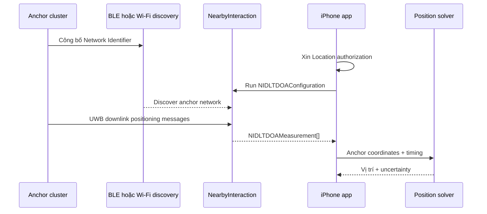

# Quy trình triển khai Apple Nearby Interaction DL‑TDoA

**Nguồn chính thức:** [Apple — Downlink time difference of arrival ranging](https://developer.apple.com/documentation/nearbyinteraction/dl-tdoa-ranging)  
**Ngày đối chiếu:** 22/08/2026

Tài liệu này chuyển hướng dẫn Apple thành quy trình triển khai cho app iPhone và cụm anchor ISP3080/QM33110.

## 1. Kiến trúc



Apple xác nhận anchor gửi message tới receiver như iPhone; receiver đo chênh lệch thời gian đến. Anchor được hỗ trợ và tương tác framework–anchor tuân thủ IEEE 802.15.4z.

## 2. Điều kiện trước khi chạy

### iPhone

- Xcode/iOS SDK có API DL‑TDoA.
- iPhone/iPad thật chạy OS hỗ trợ.
- `NISession.deviceCapabilities.supportsDLTDOAMeasurement == true`.
- Location authorization đã cấp.
- Entitlement hợp lệ nếu target OS yêu cầu; Apple ghi iOS 27+ không còn cần entitlement.

### Anchor cluster

- Cùng DL‑TDoA Session ID/Network Identifier.
- Cùng PHY, STS, schedule và configuration version.
- Address, role, slot và tọa độ riêng cho từng anchor.
- Có cluster initiator và responder.
- Timestamp/timebase được đồng bộ và hiệu chỉnh.
- Có discovery BLE hoặc Wi‑Fi phù hợp.

## 3. Kiểm tra capability

```swift
let supported = NISession.deviceCapabilities.supportsDLTDOAMeasurement
guard supported else { return }
```

Ghi lại device model, iOS version, SDK version, capability và entitlement result. Nếu capability là `false`, dừng test trên thiết bị đó.

## 4. Xin quyền Location

```swift
locationManager.requestWhenInUseAuthorization()
let status = locationManager.authorizationStatus
guard status == .authorizedWhenInUse || status == .authorizedAlways else {
    return
}
```

`Info.plist`:

```xml
<key>NSLocationWhenInUseUsageDescription</key>
<string>Ứng dụng cần quyền vị trí để nhận phép đo DL-TDoA.</string>
```

Nếu người dùng từ chối, Apple cho biết DL‑TDoA session dừng với lỗi.

## 5. Thống nhất Network Identifier

Apple xác định Network Identifier phía app là Session ID trong DL‑TDoA configuration của anchor:

```text
App networkIdentifier = 1001
Anchor A Session_ID    = 1001
Anchor B Session_ID    = 1001
Anchor C Session_ID    = 1001
Anchor D Session_ID    = 1001
```

Dùng ID khác nhau cho các deployment area gần nhau. Không mặc định đồng nhất Session ID với PAN ID hoặc MAC address.

## 6. Chọn discovery method

BLE mặc định:

```swift
let config = NIDLTDOAConfiguration(networkIdentifier: networkIdentifier)
```

Chỉ định rõ nếu exact SDK hỗ trợ:

```swift
let config = NIDLTDOAConfiguration(
    networkIdentifier: networkIdentifier,
    discoveryMethod: .bluetoothLowEnergy
)
```

App phải dùng độc quyền BLE hoặc Wi‑Fi trong vòng đời session. Chỉ dùng signature/enum đúng với header của Xcode SDK đang cài.

## 7. Cấu hình nhiều anchor

### Chung toàn cluster

- Network Identifier/Session ID.
- Channel và PHY profile.
- Preamble/SFD.
- STS mode, length và lifecycle.
- Slot, round và block duration.
- Configuration version và cluster epoch.

### Riêng từng anchor

| Anchor | Role | Address | Slot | Coordinates `(x,y,z)` |
|---|---|---:|---:|---|
| A | Cluster initiator | `0x1001` | 0 | `(0,0,2.5)` |
| B | Responder | `0x1002` | 1 | `(10,0,2.5)` |
| C | Responder | `0x1003` | 2 | `(10,8,2.5)` |
| D | Responder | `0x1004` | 3 | `(0,8,2.5)` |

Quy trình cập nhật:

1. Stage cùng `configVersion` lên mọi anchor.
2. Mỗi anchor validate và trả `READY`.
3. Commit khi đủ anchor.
4. Kích hoạt tại cùng cluster epoch.
5. Xác nhận `ACTIVE`; rollback nếu lỗi.

BLE/Wi‑Fi chỉ vận chuyển cấu hình. Không lấy thời điểm nhận BLE packet làm thời điểm phát UWB.

## 8. Đồng bộ timestamp ISP3080

```text
SYNC edge
→ capture/reset UWB timebase
→ establish cluster epoch
→ calculate slot offset
→ schedule UWB TX bằng delayed-TX hardware
→ validate actual TX timestamp
```

Mỗi anchor phát tại:

```text
T_tx(i) = T_epoch + slotOffset_i
        + syncCorrection_i + antennaCorrection_i
```

Cần đo cable delay, input/capture delay, delayed-TX quantization, TX antenna delay và temperature drift. Sai 1 ns tương đương khoảng 0,2998 m range-difference bias. Không dùng FreeRTOS delay/ISR latency để định thời RF cuối cùng.

## 9. Phát DL‑TDoA messages

Một round logic:

```text
Epoch N
├── Slot 0: Initiator A
├── Slot 1: Responder B
├── Slot 2: Responder C
└── Slot 3: Responder D
```

Firmware cần cung cấp thông tin để framework tạo measurement tương ứng: anchor address, cluster initiator, coordinates, transmit/receive timing, measurement phase/type, signal quality và clock-offset information khi áp dụng.

Phải dùng DL‑TDoA session/ranging-round mode. QANI 3.2.1 là reference cho BLE, PHY, STS và FiRa scheduler, nhưng source hiện tại ghi `Only supporting Deferred DS-TWR`; không dùng nguyên state machine đó.

## 10. Chạy Nearby Interaction session

```swift
let session = NISession()
session.delegate = self
session.delegateQueue = .main
session.run(config)
```

Xử lý đầy đủ running, suspended, resumed, invalidated, permission denied, unsupported device và discovery timeout.

Source app hiện tại:

- [DLTDoAController.swift](../ios/DLTDoATest/DLTDoATest/DLTDoAController.swift)
- [ContentView.swift](../ios/DLTDoATest/DLTDoATest/ContentView.swift)
- [DLTDoATest.xcodeproj](../ios/DLTDoATest/DLTDoATest.xcodeproj)

## 11. Nhận measurements

```swift
func session(
    _ session: NISession,
    didUpdateDLTDOA measurements: [NIDLTDOAMeasurement]
) {
    for measurement in measurements {
        // Log và gom theo cluster/round.
    }
}
```

Log typed fields được exact SDK cung cấp, gồm address, cluster initiator address, coordinates/type, transmit/receive time, measurement type, signal strength, CFO, responder clock offset và floor elevation khi có. Không dùng reflection cho logger production.

## 12. Gom observation set

Chỉ gom các measurement:

- cùng Network Identifier;
- cùng cluster initiator;
- cùng phase/round hoặc time window hợp lệ;
- có unique anchor address;
- có tọa độ hợp lệ;
- đủ số lượng anchor.

Loại/giảm trọng số khi RSSI thấp, timestamp cũ, CFO bất thường, thiếu coordinate, residual lớn hoặc geometry kém.

## 13. Tính vị trí

Chọn anchor `0` làm reference:

\[
\Delta d_i=c\left[(r_i-r_0)-(t_i-t_0)\right]
\]

\[
\|p-a_i\|-\|p-a_0\|=\Delta d_i
\]

Trong đó `p` là vị trí iPhone, `a_i` là tọa độ anchor, `r_i` là receive time, `t_i` là transmit time trong time model chung.

Solver đề xuất:

1. Chuẩn hóa coordinate frame.
2. Chọn reference anchor tốt.
3. Tạo TDoA residual.
4. Weighted nonlinear least squares.
5. Robust loss chống NLOS/outlier.
6. Xuất position, covariance/uncertainty và residual RMS.
7. Reject nghiệm ngoài deployment bounds.

Nên dùng 4+ anchor cho 2D ổn định và 5+ cho 3D thực tế.

## 14. Test tăng dần

1. **Capability:** API, permission, entitlement.
2. **Một anchor:** discovery, callback, address, coordinates, RSSI.
3. **Hai anchor:** cluster relation, TX/RX timing, relative sync bias.
4. **Ba anchor:** nghiệm 2D đầu tiên.
5. **Bốn anchor:** weighted solver và residual check.
6. **Calibration:** cable 5/10/20 m, raw/corrected offset, temperature, power-cycle, mất/phục hồi SYNC.
7. **Motion:** 1/2/3/5/10 m, availability, update rate, latency và error CDF.

## 15. Tiêu chí nghiệm thu

### App

- Capability/permission đúng.
- Session ổn định trên thiết bị thật.
- Callback typed logger hoạt động.
- Suspend/error không gây crash.

### Infrastructure

- iPhone chỉ nhận đúng Network Identifier.
- Unique address/slot và cùng config version.
- SYNC loss được phát hiện.
- Actual TX timestamp đạt timing budget.
- Coordinates đã survey.

### Solver

- Không phát position khi thiếu observation.
- Có uncertainty và residual.
- Có outlier rejection.
- Accuracy báo theo percentile/CDF.
- Raw log replay được offline.

## 16. Checklist

### iPhone

- [ ] `supportsDLTDOAMeasurement == true`
- [ ] Location permission
- [ ] Entitlement nếu cần
- [ ] Network Identifier đúng
- [ ] Discovery method đúng
- [ ] `NISession` chạy
- [ ] `didUpdateDLTDOA` có callback
- [ ] Typed logger

### Anchor

- [ ] DL‑TDoA session mode
- [ ] Session ID = Network Identifier
- [ ] PHY/STS profile chung
- [ ] Initiator/responder roles
- [ ] Unique addresses/slots
- [ ] Coordinates
- [ ] BLE/Wi‑Fi discovery
- [ ] SYNC edge → UWB timebase
- [ ] Delayed TX
- [ ] Cable/antenna calibration
- [ ] Sync-loss handling

### Solver

- [ ] Measurement grouping
- [ ] Clock/sync correction
- [ ] Weighted 2D solver
- [ ] 3D option
- [ ] Robust outlier rejection
- [ ] Residual/uncertainty
- [ ] Offline replay tests

## 17. Trạng thái repository

- iPhone capability/logger và `.xcodeproj`: đã tạo, chờ build trên macOS/iPhone thật.
- QANI 3.2.1: đã xác định BLE config, FiRa scheduler, PHY/STS mapping; hiện là Deferred DS‑TWR.
- ISP3080 SYNC: cần xác nhận edge → QM33110 timebase và hiệu chỉnh delay.
- DL‑TDoA anchor session: cần tích hợp initiator/responder mode.
- Position solver: chưa triển khai.

## Tham chiếu

1. [Apple DL‑TDoA ranging](https://developer.apple.com/documentation/nearbyinteraction/dl-tdoa-ranging)
2. [NIDLTDOAConfiguration](https://developer.apple.com/documentation/nearbyinteraction/nidltdoaconfiguration)
3. [NIDLTDOAMeasurement](https://developer.apple.com/documentation/nearbyinteraction/nidltdoameasurement)
4. [supportsDLTDOAMeasurement](https://developer.apple.com/documentation/nearbyinteraction/nidevicecapability/supportsdltdoameasurement)
5. [QANI fira_niq.c](../../scratch_qani/QANI-All-FreeRTOS_QNI_3_0_0/Projects/Src/Apps/Src/fira/QANI/fira_niq.c)
6. [QANI ble_niq.c](../../scratch_qani/QANI-All-FreeRTOS_QNI_3_0_0/Projects/Src/Comm/Src/BLE/niq/ble_niq.c)
